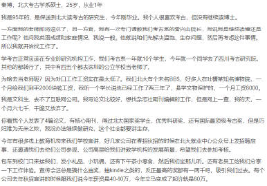
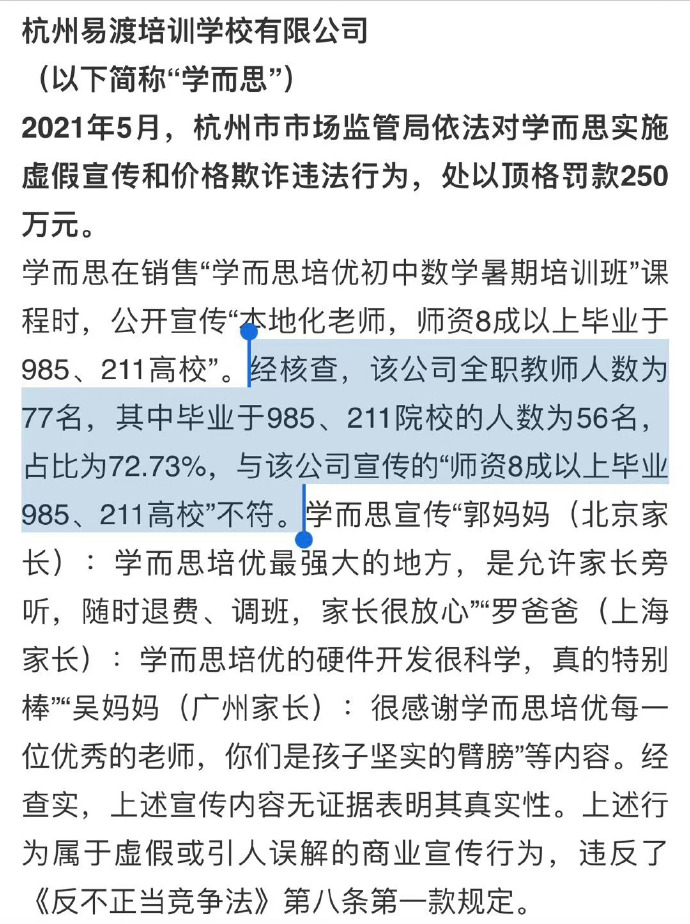
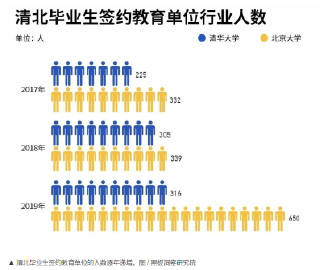

# 张雪峰问题解读
source:https://weibo.com/2382064902/N6Mql3kTk

# 内容
张雪峰老师遇到的问题其实和大家想的不一样。根本没人在乎学生如何填报志愿。因为我们高校录取的时候可以“调剂”。只要是稍好的大学压根就不愁学生不去报专业。真正的问题一直都是学生一旦发现这个专业就业不好，他很可能会退学高复。这样的情况集体出现，教学秩序就无法维持。而这里面还有一个特别麻烦的背景是我国这几年名校的弱势专业突然间就业出现了严重的问题。

我和人合作高校就业问题有十多年了。从头到尾就是为了研究这些学生毕业能赚多少钱，将来能加多少杠杆买房。基本每年都会有认识的记者来找我谈大学生选专业的问题。和我合作的老师开始几年会反反复复提醒我什么可以说，什么绝对不能说。他还教了我一套“口径”。

简单说起来就是和大众讲的时候，只能讲什么专业就业好，但是不能讲具体哪个专业就业不好。提到就业不好的时候就笼统的说“文科类专业就业都不好”。这符合大众的印象，也是一句正确的废话。其实就业衡量有两个指标，一个是毕业五年后的平均薪水，另一个是毕业后的就业相关度。薪水低，就业和学的东西没关系，就是这个专业真没必要去读。文科类专业间差异也非常大。

明明研究方法和数据都有。不管官方还是私人机构，这些年你去网上死命搜，都绝对找不到任何一所大学分专业的统计。原因也和我上面提的一样，不是在乎学生不报名，而是在乎学生被调剂了之后退学高复。

那么这几年到底出了什么变化导致985高校的就业出现严重问题？

网络上官方数据是有的。主要都是以男女数据为主。一些985大学女生校招签约率只有男生的一半。新闻解读说是因为对女生的就业歧视，大众会以为是女生多数读文科，其实答案都是错的。你想想，2019年的毕业生和2022，23年的毕业生毕业专业一样，怎么这几年他们就突然就业不了了呢？

你再看我上面提到的“就业相关度”的数据。985高校有很多专业就业相关度非常差，但是他们的待遇其实不错。原因就是之前的名校生毕业确实压根不愁找工作。所以大家会产生学什么不重要，名校毕业就好的“印象”。但是这几年，这个印象要改了。

因为容纳他们就业的蓄水池全没了。注意，是除去考公外，全都没有了。

这里面最典型的是教培。我们看一份处罚决定，有个具体数据大家更明白。比如杭州的学而思就被抓过虚假宣传。他们说自己的老师8成毕业于985211名校。最后查出来比例说是72.73%。这些年迅猛发展的教培行业，给了985211这些名校中专业不对口的毕业生高薪的机会。哪怕是清北，过去几年也是有越来越多的毕业生进入了教培行业。数据和案例我配图中都贴出来了。

还有一个典型是房地产。除去不挑专业的房产中介，核心问题是房地产的上下游影响太多了。一旦新开工的面积减少，自然而然就导致上下游整个产业链萎缩。很多你看着特别高大上的专业一下子就业就完蛋了。而且从目前来看，很可能会持续很多年。当然，我也会坚持所谓的“原则”，不去提具体哪个专业就业必然只能长期衰退。

我只是希望那些今年考上名校的学生，在选专业的时候多注意“就业相关度”。

最后就是我写这篇文章的动机。我想讲的是“变化”。就是我们的高校教育到了拐点，目前是不得不变。我们未来的学生会越来越少，高校的教师和专业也必然要淘汰。过去我们是用信息差的方法，引导和调剂学生去读那些对他们发展并不利，招生规模也远超社会需要的专业来掩盖我们高校无序扩招的问题。

现在，要改了。

